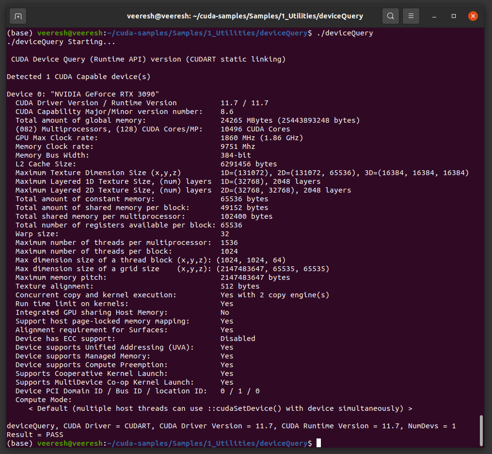
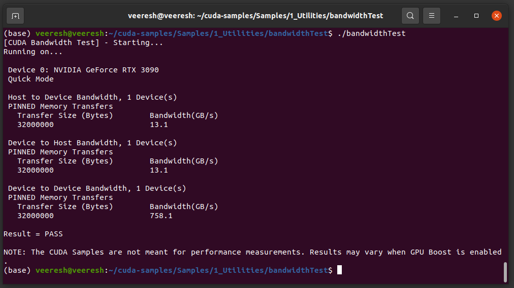
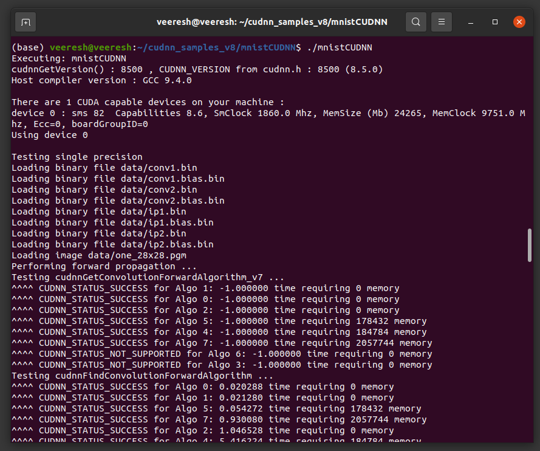
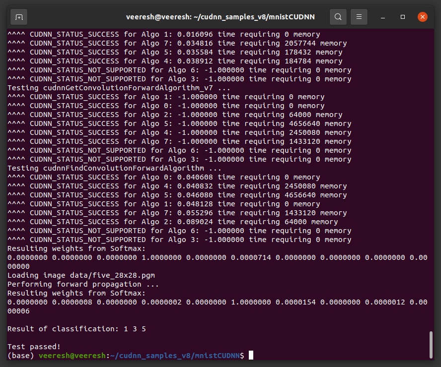
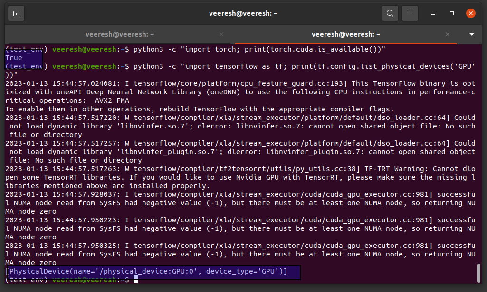

# DL-Setup-on-Ubunutu-20.04

This repo walks you through the steps that are needed for the installation of the Deep learning frameworks like PyTorch, Tensforflow on Ubuntu machine 20.04 LTS. 


> *Note : This setup guideline has been verified with the latest version of the  Ubunutu 22.04 LTS version*


## Tabel of contents

1. Install Ubuntu 20.04 LTS
2. Install Cuda Toolkit
3. Install CudaNN Library
4. Install the DL frameworks 


-----------------------------------------------------------------------------------------

# Install ubuntu 20.04 LTS 

Firstly, download the Ubunutu OS image from the official website [link](https://releases.ubuntu.com/focal/ubuntu-20.04.5-desktop-amd64.iso). Then, flash the OS into bootable pen drive. You can use [Rufus](https://rufus.ie/en/) on windows or Startup disk creator on Ubuntu amchine to make a USB stick as pendrive. 

After installing the OS, run the folowing commands to update the OS. 


```
sudo apt update
sudo apt full-upgrade  --yes
sudo apt autoremove --yes
sudo apt autoclean --yes
reboot
```


## Install utility applications (optional)


###  Neofetch 

This is needed to get know the sytem's software and hardware details. With the hep of this library, we can get to know the GPU model name.  Later this model number will help us to downlaod the recommended cuda tools for leveraging the GPU. 

   
   ```
   # install it by running the following command 
   sudo apt install neofetch
	# launch it 
	neofetch
   ```


### U Launcher 
Install the U launcher application to quickly navigate between the applications on Ubunutu.  

```
#Install via PPA (Ubuntu): 
sudo add-apt-repository ppa:agornostal/ulauncher && sudo apt update && sudo apt install ulauncher
```


## Install Google Chrome

```
# Install google chrome browser
sudo dpkg -i <chrome-file-name.deb>
```


## Install Anaconda

Anaconda simplifies the python packages / environments. The official website link to downdload the `.sh` file can be found [here](https://www.anaconda.com/products/distribution#linux)

```
# Navigate to the Downloads folder, 
CD ~/Downloads

# Firstly, install the dependencies 
apt-get install libgl1-mesa-glx libegl1-mesa libxrandr2 libxrandr2 libxss1 libxcursor1 libxcomposite1 libasound2 libxi6 libxtst6

# Dowload the and anaconda file(.sh file) and chehcksum from the official website's link. 
shasum -a Anaconda3-2022.10-Linux-x86_64.sh

# To install  the anaconda software, run the below command
bash ~/Downloads/Anaconda3-2022.10-Linux-x86_64.sh

```


-------------------

# Install Cuda Toolkit 

When installing CUDA, I usually follow the CUDA installation guide, which is very complete  ([https://docs.nvidia.com/cuda/cuda-installation-guide-linux/index.html](https://docs.nvidia.com/cuda/cuda-installation-guide-linux/index.html)).


> *Note:  This guide aims to install the cuda 11.7 version which was release in August 2022 and this toolkit also install the right version of the Nvidia driver*


## Pre-installation checks 

Perform the preinstallation checks to avoid messing up with the installation of the cuda. 


1. To verify if our GPU is CUDA-cable, issue the below command,     
		`lspci | grep -i nvidia`
	Nvidia products contain the respective release notes.  
	
2. Verify you are running 64 bit  OS, 
		`uname -m && cat /etc/*release`
	You should  be able to see something like this, `x86_64`

3. verify gcc is installed on your system, 
		`gcc --version  # TO install gcc, sudo apt install build-essential`
		

4. Verify the System has the Correct Kernel Headers and Development Packages Installed. TO know the version of the kernel, 
		`uname  -r`
	 This is the version of the kernel headers and development packages that must be installed prior to installing the CUDA Drivers.

5. The kernel headers and development packages for the currently running kernel can be installed with: (*very important step*)
		`sudo apt-get install linux-headers-$(uname -r)`   
 
 6. Remove the outdated signing key (*improtant step*)   
	 sudo apt-key del 7fa2af80


## Installing cuda Toolkit (11. 7v)

We choose debian (local) package installation method to install the cuda on Ubunutu 20.04 LTS.  


```
# step 1 
wget https://developer.download.nvidia.com/compute/cuda/repos/ubuntu2004/x86_64/cuda-ubuntu2004.pin

# step 2 
sudo mv cuda-ubuntu2004.pin /etc/apt/preferences.d/cuda-repository-pin-600

# step 3
wget https://developer.download.nvidia.com/compute/cuda/11.7.1/local_installers/cuda-repo-
ubuntu2004-11-7-local_11.7.1-515.65.01-1_amd64.deb

# step 4
sudo dpkg -i cuda-repo-ubuntu2004-11-7-local_11.7.1-515.65.01-1_amd64.deb

# step 5
sudo cp /var/cuda-repo-ubuntu2004-11-7-local/cuda-*-keyring.gpg /usr/share/keyrings/

# step 6
sudo apt-get update

# step 7
sudo apt-get -y install cuda
```


## Post installtion steps 


1. Add the below path to `PATH` variable
`export PATH=/usr/local/cuda-12.0/bin${PATH:+:${PATH}}`


### Verify the cuda toolkit installation

- Verify the driver version by running the below command,
`cat /proc/driver/nvidia/version`

- Run the deviceQuery and bandwidthTest for verifying the cuda installtaion

``` 
# step 0: naviagte to Download dir
cd ~/Downloads

# step 1: Download the cuda sampels 
git clone https://github.com/NVIDIA/cuda-samples.git

# step 2: switch to cuda-samples dir
cd cuda-samples/

# step 3: checkout to the old release because we are using cuda 11.7
git checkout v11.6

# step 4: build the cuda samples 
make 

# step 5: navigate to devicequery
cd Samples/1_Utilities/deviceQuery

# step 6: run the below command and check if tests have been passed. This ensures cuda software is installed and configured properly. Please refer to the below screenshot for the sample output.   
./deviceQuery

# step 7: Navigate to bandwidthtest dir
cd ../bandwidthTest/

# step 8: run the bandwdith test to ensure system and cuda-capable devices communicate properly. A sample output is shown in the below screenshots.   
./bandwidthTest


```
A sample output of the devicequery is shown below:  




A sample output of the bandwidthTest is shown below:  




--------------

# Install cudaNN library 


> *Note : In this guide we aim to install CudaNN v8.5.0  for Cuda 11.x (launched in August 2022)*


## Pre-installation checks

1. Make sure Nvidia's graphic drivers and Cuda toolkit are installed on the Ubunutu machine. 
2. Install the zlib library on Ubunutu
	`sudo apt-get install zliblg`


## Install cudaNN 

- You would need an account with Nvidia developer website. Do create one if there isn't. Download the CudaNN debian package for UBunut 20.04 LTS ([Download cuDNN v8.5.0 (August 8th, 2022), for CUDA 11.x](https://developer.nvidia.com/rdp/cudnn-archive#a-collapse850-116)) 
  download link : https://developer.nvidia.com/rdp/cudnn-archive


```
# step 1: Navigate to your <cudnnpath> directory containing the cuDNN Debian local installer file.(swith to Download direcotry)

# step 2: Enable the local repository.
sudo dpkg -i cudnn-local-repo-ubuntu2204-8.5.0.96_1.0-1_amd64.deb

# step 3: Import the CUDA GPG key. 
sudo cp /var/cudnn-local-repo-*/cudnn-local-*-keyring.gpg /usr/share/keyrings/

# step 4: Refresh the repository metadata
sudo apt-get update
 
# step 5: Install the runtime library.
sudo apt-get install libcudnn8=8.5.0.96-1+cuda11.7

# step 6: Install the developer library.
sudo apt-get install libcudnn8-dev=8.5.0.96-1+cuda11.7

# step 7: Install the code samples and the cuDNN library documentation.
sudo apt-get install libcudnn8-samples=8.5.0.96-1+cuda11.7

```


## Post installation

### Verfify the CudaNN installation 

By referring to the official CudaNN installation [guide](https://docs.nvidia.com/deeplearning/cudnn/index.html) for the Linux, 

```
# step 1: Copy the cuDNN samples to a writable path.   
cp -r /usr/src/cudnn_samples_v8/ $HOME

# step 2:  Go to the writable path.
cd  $HOME/cudnn_samples_v8/mnistCUDNN
   
# step 3: Compile the mnistCUDNN sample.
make clean && make
   
# step 4: Run the mnistCUDNN sample.
 ./mnistCUDNN
   
# If cuDNN is properly installed and running on your Linux system, you will see a message similar to the following:
# Test passed!

```








-----------------------

# Install the Deep learning frameworks (Tensorflow, Pytorch)

```
# step 1: create a conda env 
conda create -n test_env python=3.9

# step 2: activate the created env 
conda activate test_env

# step 3: install the pytorch using conda (make sure you slect the currect installed version of the cuda) 
conda install pytorch torchvision torchaudio pytorch-cuda=11.7 -c pytorch -c nvidia

# step 4: install tensorflow 
python3 -m pip install tensorflow

# step 5: Verify wether pytorch detects GPU or not  
python3 -c "import torch; print(torch.cuda.is_available())"

# step 6: Verify wether Tensorflow detects GPU or not  
python3 -c "import tensorflow as tf; print(tf.config.list_physical_devices('GPU'))"

```




This completes the Deep learning setup on Ubunutu machine!!